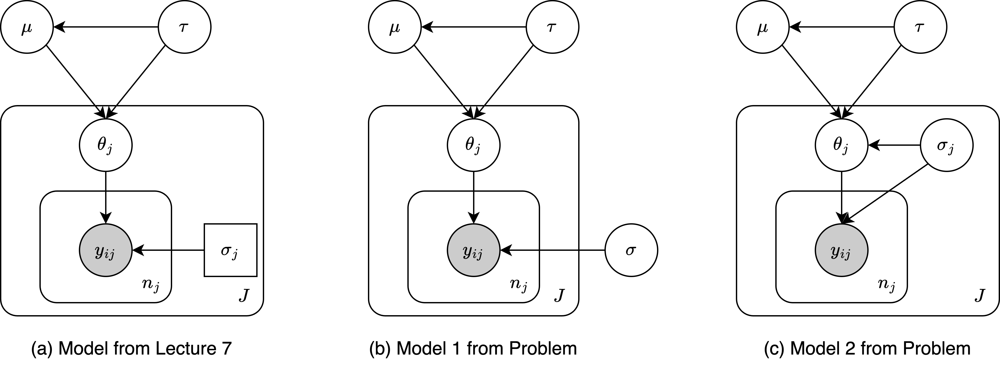

```{r setup, include=FALSE}
library(bayesplot)
library(dplyr)
library(ggplot2)
library(moments)
library(patchwork)
library(rstan)
library(tidyr)
bayesplot_theme_set(theme_default(base_size = 12, base_family = "sans"))
```

# Gibbs Sampling for Normal Hierarchical Models

In Lecture 7, we modeled the NBA data with a normal hierarchical model with
known variances as follows:
$$p(\mu,\tau^{2}) = p(\mu|\tau^{2})p(\tau^{2})\propto p(\tau^{2})$$
$$\theta_{j}|\mu,\tau^{2}\overset{\text{i.i.d}}{\sim}\mathcal{N}(\mu,\tau^2), j=1,\ldots,J$$
$$y_{ij}|\theta,\sigma^{2},\mu,\tau^{2}\overset{\perp\!\!\!\!\perp}{\sim}\mathcal{N}(\theta_{j}, \sigma_{j}^{2}),\quad i=1,\ldots,n_{j}.$$
Now we will extend this to allow the variances $\sigma^{2}_{j}$ to be unknown
as well. We will consider two models:

1.  **Unknown but identical variances**:
    $\sigma_{1}^{2}=\ldots=\sigma_{J}^{2}=\sigma^{2}$, with
    $\sigma^{2}\sim p_{v}$
2.  **Unknown and independent variances**:
    $\sigma_{1}^{2},\ldots,\sigma_{J}^{2}\overset{\text{i.i.d}}{\sim} p_{v}$.

For both models, set $p_{v}(\sigma^{2})\propto 1/\sigma$. Your task is to
implement a Gibbs sampler to simulate all latent variables given the data from
`nba_data.csv`. The Gibbs sampler involves the following steps for each
iteration:

-   (*For both models*) Sample from
    $\mu,\tau^{2}|\theta_{1},\ldots,\theta_{J},\sigma_{1}^{2},\ldots,\sigma_{J}^{2},Y$,
    and then
-   (*For model 1*) Sample from
    $\theta_{1},\ldots,\theta_{J}|\sigma^{2},\mu,\tau^{2},Y$, and then
    $\sigma^{2}|\theta_{1},    \ldots,\theta_{J},\mu,\tau^{2},Y$
-   (*For model 2*) Sample from
    $(\theta_{1},\sigma_{1}^{2}),\ldots,(\theta_{J}, \sigma_{J}^{2})|\mu,\tau^{2},Y$.

For full credit, for each model, you need to:

1.  (15 points) Write down the form of the conditional distributions above.
2.  (25 points) Write down R code to implement the Gibbs samplers.
3.  (30 points) Run the two Gibbs samplers on the NBA dataset and summarize the
    results. Specifically, for $\mu$, $\tau^2$ and a few $\theta_{j}$ and
    $\sigma_{j}$, plot the MCMC traceplots, and diagnose mixing. Also plot the
    corresponding posterior distributions.
4.  (30 points) Comment on how the posterior distributions differ from each
    other. Use each model to make predictions on the NBA games from the rest of
    the season (following code from Lecture 7), and comment on which model (or
    the model with known variances from Lecture 7) performs best.

\pagebreak

**Solution:**

```{r nba-pgm, echo = FALSE, fig.cap = "Probabilistic graphical model for the NBA data."}

```

First, we load in the data. Instead of recording the score for each game
$y_{ij},i=1,\ldots,n_{j}$, we can see from the data that it only gives the
average score $\bar{y}_{j}=\frac{1}{n_{j}}\sum\limits_{i=1}^{n_{j}}y_{ij}$ for
each team $j=1,\ldots,J$.

```{r read-nba-data}
if (file.exists("data/NBA_data.csv")) {
  df <- read.csv("data/NBA_data.csv")[, -1]
} else {
  stop("FileNotFound: data file not found at 'data/NBA_data.csv'.")
}
head(df)
```

As illustrated by Figure 1, the conditional structure among $\mu$, $\tau$, and
$\theta_{j},j=1,\ldots,J$ are exact in the model from lecture 7 and models in
this problem. According to Bayes' theorem, we have the following conditional
distribution: $$
\begin{aligned}
  \log{p}(\mu,\tau^{2}\mid\boldsymbol{\theta},\boldsymbol{\sigma}^{2},Y) &= \log{p}(\mu,\tau^{2}) + \sum\limits_{j=1}^{J}\log{p}(\theta_{j}\mid\mu,\tau^{2}) + \text{constant} \\
  &= -\log(\tau) - \frac{1}{2}\sum\limits_{j=1}^{J}\left[\log(\tau^{2}) + \frac{(\theta_{j}-\mu)^{2}}{\tau^{2}}\right],
\end{aligned}
$$ where the constant is a term that is irrelevant to either $\mu$ or $\tau$.
Herein, we can complete the square of $\mu$ by $$
  \sum\limits_{j=1}^{J}(\theta_{j}-\mu)^{2} = \sum\limits_{j=1}^{J}(\theta_{j}-\bar{\theta})^{2} + J(\mu - \bar{\theta})^{2},\quad\text{where }\bar{\theta}=\frac{1}{J}\sum\limits_{j=1}^{J}\theta_{j}.
$$ Therefore, the log-posterior density of $(\mu,\tau^{2})$ writes $$
  \log{p}(\mu,\tau^{2}\mid\boldsymbol{\theta},\boldsymbol{\sigma}^{2},Y) = \log{p}(\mu,\tau^{2}|\boldsymbol{\theta}) = -\log(\tau) - \frac{J}{2}\log(\tau^{2})-\frac{1}{2\tau^{2}}\left[\sum\limits_{j=1}^{J}(\theta_{j}-\bar{\theta})^{2} + J(\mu-\bar{\theta})^{2}\right].
$$ By factorizing terms that are related to $\mu$ and $\tau^{2}$ only, we can
derive the conditional distribution of $\mu$ and $\tau^{2}$ as follows: $$
\tag{(1)}
\begin{aligned}
  p(\mu\mid\tau^{2},\boldsymbol{\theta},\boldsymbol{\sigma}^{2},Y) &\sim \mathcal{N}(\bar{\theta}, \tau^{2}/J), \\
  p(\tau^{2}\mid\mu,\boldsymbol{\theta},\boldsymbol{\sigma}^{2},Y) &\sim\text{Scal-inv-}\chi^{2}\left(J, \frac{1}{J}\sum\limits_{j=1}^{J}(\theta_{j}-\mu)^{2}\right).
\end{aligned}
$$ For the model lecture, as illustrated by Figure 1(a), we have
$\bar{y}_{j}\sim\mathcal{N}\left(\theta_{j},\frac{1}{n_{j}}\sigma_{j}^{2}\right)$,
where $\bar{y}_{j}=\frac{1}{n_{j}}\sum\limits_{i=1}^{n_{j}}y_{ij}$. Therefore,
for model 1 in Figure 1(b), the conditional distribution of $\theta_{j}$ can be
derived as follows: $$
\begin{aligned}
  \log{p}(\theta_{1},\ldots,\theta_{j}\mid\mu,\tau^{2},\sigma^{2},Y) &= \sum\limits_{j=1}^{J}\log{p}(\theta_{j}|\mu,\tau^{2}) + \log{p}(\bar{y}_{j}|\theta_{j},\sigma_{j}^{2}) + \text{constant} \\
  &= -\frac{1}{2}\sum\limits_{j=1}^{J}\frac{(\bar{y}_{j}-\theta_{j})^{2}}{\sigma^{2}/n_{j}} + \frac{(\theta_{j}-\mu)^{2}}{\tau^{2}} + \text{constant}, \\
\end{aligned}
$$ where the constant is a term that is irrelevant to any of the $\theta_{j}$.
Similarly, we can complete the square of $\theta_{j}$ by $$
  \frac{(\bar{y}_{j}-\theta_{j})^{2}}{\sigma^{2}/n_{j}}+\frac{(\theta_{j}-\mu)^2}{\tau^{2}} = \left(\frac{n_{j}}{\sigma^{2}} + \frac{1}{\tau^{2}}\right)\cdot\left(\theta_{j}-\left(\frac{n_{j}}{\sigma^{2}} + \frac{1}{\tau^{2}}\right)^{-1}\cdot\left(\frac{n_{j}\bar{y}_{j}}{\sigma^{2}}+\frac{\mu}{\tau^{2}}\right)\right)^{2}.
$$ Therefore, the conditional distribution of $\theta_{j}$ writes
$\theta_{j}\sim\mathcal{N}(\hat{\mu}_{j},\sigma_{\mu}^{2})$, where $$
\begin{aligned}
  \hat{\mu}_{j} &= \frac{\tau^{2}\bar{y}_{j} + \sigma^{2}\mu/n_{j}}{\tau^{2} + \sigma^{2}/n_{j}}, \\
  \sigma_{\mu}^{2} &= \left(\frac{n_{j}}{\sigma^{2}} + \frac{1}{\tau^{2}}\right)^{-1}.
\end{aligned}
$$ The conditional posterior distribution of $\sigma^{2}$ can be derived as
follows: $$
\begin{aligned}
  \log{p}(\sigma^{2}\mid\mu,\tau^{2},\boldsymbol{\theta},Y) &= \log{p}_{v} + \log{p}(Y\mid\theta,\sigma^{2}) + \text{constant} \\
  &= -\log(\sigma) - \frac{1}{2}\sum\limits_{j=1}^{J}\sum\limits_{i=1}^{n_{j}}\left[\log(\sigma^{2}) + \frac{(y_{ij}-\theta_{j})^{2}}{\sigma^{2}}\right] + \text{constant},
\end{aligned}
$$ where the constant is a term that is irrelevant to $\sigma^{2}$. Therefore,
the conditional distribution of $\sigma^{2}$ writes $$
  p(\sigma^{2}\mid\mu,\tau^{2},\boldsymbol{\theta},Y)\sim\text{Scale-inv-}\chi^{2}\left(\sum\limits_{j=1}^{J}n_{j}, \frac{1}{\sum_{j=1}^{J}n_{j}}\sum\limits_{j=1}^{J}\sum\limits_{i=1}^{n_{j}}(y_{ij}-\theta_{j})^{2}\right).
$$

The implementation of the Gibbs sampler for the two models is as follows:

```{r gibbs-sampling-1}
gibbs_sampler_1 <- function(y_bars, n_j, sigma_j_sq, n_iter, burn) {
  # Get number of teams
  n_teams <- length(y_bars)

  # Initialize the Gibbs sampler
  pstr_mu <- rep(NA, nrow = n_iter)
  pstr_mu[1] <- mean(y_bars)

  pstr_tau_sq <- rep(NA, nrow = n_iter)
  pstr_tau_sq[1] <- 1

  pstr_theta <- matrix(NA, nrow = n_iter, ncol = n_teams)
  pstr_theta[1, ] <- y_bar

  pstr_sigma_sq <- rep(NA, nrow = n_iter)
  pstr_sigma_sq[1] <- 1

  # Run the Gibbs sampler
  for (i in 2:n_iter) {
    # Update mu
    pstr_mu[i] <- (
      mean(pstr_theta[i - 1, ]) + rnorm(1) * sqrt(pstr_tau_sq[i - 1] / n_teams)
    )

    # Update tau-square
    tau_scale <- sum((pstr_theta[i - 1, ] - pstr_mu[i - 1])^2) / (n_teams - 1)
    pstr_tau_sq[i] <- (n_teams - 1) * tau_scale / rchisq(1, n_teams - 1)

    # Update theta and sigma-square
    prcsn <- 1 / pstr_tau_sq[i] + n_j / pstr_sigma_sq[i - 1]
    mu_hat <- (
      pstr_mu[i] / pstr_tau_sq[i] + n_j * y_bars / pstr_sigma_sq[i - 1]
    ) / prcsn
    pstr_theta[i, ] <- mu_hat + rnorm(n_teams) / sqrt(prcsn)

    sigma_sq_scale <- (
      sum(n_j * sigma_j_sq + n_j * ((pstr_theta[i] - y_bar)^2)) / sum(n_j)
    )
    pstr_sigma_sq[i] <- sigma_sq_scale * sum(n_j) / rchisq(1, sum(n_j))
  }

  return(
    list(
      tau = sqrt(pstr_tau_sq)[(burn + 1):n_iter],
      mu = pstr_mu[(burn + 1):n_iter],
      theta = pstr_theta[(burn + 1):n_iter, ],
      sigma = sqrt(pstr_sigma_sq)[(burn + 1):n_iter]
    )
  )
}

# Extract the required variables
n <- df$number_games_played
sigma_sq <- df$sample_sd
y_bar <- df$Y_bar

# Run the Gibbs sampler for model 1
set.seed(42)
m1_smpls <- gibbs_sampler_1(
  y_bars = y_bar,
  n_j = n,
  sigma_j_sq = sigma_sq,
  n_iter = 5000,
  burn = 3000
)
```

For model 2, as illustrated by Figure 1(c), we have a conjugate structure
between $(\theta_{j},\sigma_{j})$ and $y_{ij}$. Therefore, the conditional
distribution of $(\theta_{j},\sigma_{j})$ can be derived as follows: $$
\begin{aligned}
  \log{p}(\theta_{j},\sigma_{j}^{2}\mid\mu,\tau^{2},Y) &= \sum\limits_{j=1}^{J}\log{p}_{v} + \log{p}(\theta_{j}|\mu,\tau^{2}\sigma^{2}) + \log{p}(\bar{y}_{j}\mid\theta_{j},\sigma_{j}^{2}) + \text{constant} \\
  &= -\sum\limits_{j=1}^{J}\log(\sigma_{j}) - \frac{1}{2}\sum\limits_{j=1}^{J}\sum\limits_{i=1}^{n_{j}}\left[\log(\sigma_{j}^{2})+\frac{(y_{ij}-\theta_{j})^{2}}{\sigma^{2}_{j}}  +\log(\tau^{2}\sigma_{j}^{2})+\frac{(\theta_{j}-\mu)^{2}}{2\tau^{2}\sigma_{j}^{2}}\right] + \text{constant},
\end{aligned}
$$ where the constant is a term that is irrelevant to either $\theta_{j}$ or
$\sigma_{j}$. By completing the square of $\theta_{j}$ and $\sigma_{j}^{2}$, we
can derive the conditional distribution of $(\theta_{j},\sigma_{j}^{2})$ as
follows: $$
\begin{aligned}
  p(\theta_{j}\mid\sigma_{j}^{2},\mu,\tau^{2},Y) &\sim \mathcal{N}\left(\frac{\tau^{2}\bar{y}_{j} + \mu/n_{j}}{\tau^{2} + 1/n_{j}}, \left(\frac{n_{j}}{\sigma^{2}} + \frac{1}{\tau^{2}\sigma^{2}}\right)^{-1}\right) \\
  p(\sigma_{j}^{2}\mid\theta_{j},\mu,\tau^{2},Y) &\sim \text{Scale-inv-}\chi^{2}\left(n_{j}, \frac{1}{n_{j}}\left[\frac{(\theta_{j}-\mu)^{2}}{\tau^{2}} + \sum\limits_{i=1}^{n_{j}}(y_{ij}-\theta_{j})^{2}\right]\right).
\end{aligned}
$$

```{r gibbs-sampling-2}
gibbs_sampler_2 <- function(y_bars, n_j, sigma_j_sq, n_iter, burn) {
  # Get number of teams
  n_teams <- length(y_bars)

  # Initialize the Gibbs sampler
  pstr_mu <- numeric(n_iter)
  pstr_mu[1] <- mean(y_bars)

  pstr_tau_sq <- numeric(n_iter)
  pstr_tau_sq[1] <- 1

  pstr_theta <- matrix(NA, nrow = n_iter, ncol = n_teams)
  pstr_theta[1, ] <- y_bars

  pstr_sigma_sq <- matrix(NA, nrow = n_iter, ncol = n_teams)
  pstr_sigma_sq[1, ] <- sigma_j_sq

  # Run the Gibbs sampler
  for (i in 2:n_iter) {
    # Update mu
    pstr_mu[i] <- (
      mean(pstr_theta[i - 1, ]) + rnorm(1) * sqrt(pstr_tau_sq[i - 1] / n_teams)
    )

    # Update tau-square
    tau_scale <- sum((pstr_theta[i - 1, ] - pstr_mu[i - 1])^2) / (n_teams - 1)
    pstr_tau_sq[i] <- (n_teams - 1) * tau_scale / rchisq(1, n_teams - 1)

    # Update theta and sigma-square
    prcsn <- (
      1 / pstr_tau_sq[i] / pstr_sigma_sq[i - 1] + n_j / pstr_sigma_sq[i - 1]
    )
    mu_hat <- (
      pstr_mu[i] / pstr_tau_sq[i] / pstr_sigma_sq[i - 1]
      + n_j * y_bars / pstr_sigma_sq[i - 1, ]
    ) / prcsn
    pstr_theta[i, ] <- mu_hat + rnorm(n_teams) / sqrt(prcsn)

    for (j in 1:n_teams) {
      sigma_sq_scale <- (
        n_j[j] * sigma_j_sq[j]
        + n_j[j] * (pstr_theta[i, j] - y_bars[j]) ^ 2
        + (pstr_theta[i, j] - pstr_mu[i]) ^ 2 / pstr_tau_sq[i]
      )
      pstr_sigma_sq[i, j] <- sigma_sq_scale / rchisq(1, n_j[j])
    }


  }
  return(
    list(
      tau = sqrt(pstr_tau_sq)[(burn + 1):n_iter],
      mu = pstr_mu[(burn + 1):n_iter],
      theta = pstr_theta[(burn + 1):n_iter, ],
      sigma = sqrt(pstr_sigma_sq)[(burn + 1):n_iter, ]
    )
  )
}

# Extract the required variables
n <- df$number_games_played
sigma_sq <- df$sample_sd
y_bar <- df$Y_bar

# Run the Gibbs sampler for model 1
set.seed(42)
m2_smpls <- gibbs_sampler_2(
  y_bars = y_bar,
  n_j = n,
  sigma_j_sq = sigma_sq,
  n_iter = 5000,
  burn = 3000
)
```

The following visualization shows the posterior distributions and the MCMC trace plots of $\mu$ in model 1 and model 2. The trace plots show that the MCMC chains are well-mixed and converged. The posterior distributions show that the posterior distribution of $\mu$ in model 1 is more concentrated than that in model 2. The posterior distribution of $\tau$ in model 1 is more concentrated than that in model 2. The posterior distribution of $\theta_{1}$ in model 1 is more concentrated than that in model 2. The posterior distribution of $\sigma_{1}$ in model 1 is more concentrated with an higher average than that in model 2.

```{r plot-mcmc-traceplots-mu}
# Plot the MCMC trace plots
m1_df <- data.frame(indx = 1:2000, samples = m1_smpls$mu)
m2_df <- data.frame(indx = 1:2000, samples = m2_smpls$mu)
plot1 <- (
  ggplot(m1_df)
    + geom_density(aes(x=samples))
    + labs(title = "Posterior Distribution of mu in Model 1")
)
plot2 <- (
  ggplot(m1_df)
    + geom_line(aes(x=indx, y=samples))
    + labs(title = "Traceplot of mu in Model 1")
)
plot3 <- (
  ggplot(m2_df)
    + geom_density(aes(x=samples))
    + labs(title = "Posterior Distribution of mu in Model 2")
)
plot4 <- (
  ggplot(m2_df)
    + geom_line(aes(x=indx, y=samples))
    + labs(title = "Traceplot of mu in Model 2")
)
(plot1 + plot2) / (plot3 + plot4)
```


The following visualization shows the posterior distributions and the MCMC trace plots of $\tau$ in model 1 and model 2. The trace plots show that the MCMC chains are well-mixed and converged. The posterior distributions show that the posterior distribution of $\tau$ in model 1 is overall lower than that in model 2.

```{r plot-mcmc-traceplots-tau}
# Plot the MCMC trace plots
m1_df <- data.frame(indx = 1:2000, samples = m1_smpls$tau)
m2_df <- data.frame(indx = 1:2000, samples = m2_smpls$tau)
plot1 <- (
  ggplot(m1_df)
    + geom_density(aes(x=samples))
    + labs(title = "Posterior Distribution of Tau in Model 1")
)
plot2 <- (
  ggplot(m1_df)
    + geom_line(aes(x=indx, y=samples))
    + labs(title = "Traceplot of Tau in Model 1")
)
plot3 <- (
  ggplot(m2_df)
    + geom_density(aes(x=samples))
    + labs(title = "Posterior Distribution of Tau in Model 2")
)
plot4 <- (
  ggplot(m2_df)
    + geom_line(aes(x=indx, y=samples))
    + labs(title = "Traceplot of Tau in Model 2")
)
(plot1 + plot2) / (plot3 + plot4)
```

The following visualization shows the posterior distributions and the MCMC trace plots of $\theta_{1}$ in model 1 and model 2. The trace plots show that the MCMC chains are well-mixed and converged. The posterior distributions show that the posterior distribution of $\theta_{1}$ in model 2 is more concentrated than that in model 1. The mean of the two distribution is similar.

```{r plot-mcmc-traceplots-theta}
# Plot the MCMC trace plots
m1_df <- data.frame(indx = 1:2000, samples = m1_smpls$theta[, 1])
m2_df <- data.frame(indx = 1:2000, samples = m2_smpls$theta[, 1])
plot1 <- (
  ggplot(m1_df)
    + geom_density(aes(x=samples))
    + labs(title = "Posterior Distribution of Theta 1 in Model 1")
)
plot2 <- (
  ggplot(m1_df)
    + geom_line(aes(x=indx, y=samples))
    + labs(title = "Traceplot of Theta 1 in Model 1")
)
plot3 <- (
  ggplot(m2_df)
    + geom_density(aes(x=samples))
    + labs(title = "Posterior Distribution of Theta 1 in Model 2")
)
plot4 <- (
  ggplot(m2_df)
    + geom_line(aes(x=indx, y=samples))
    + labs(title = "Traceplot of Theta 1 in Model 2")
)
(plot1 + plot2) / (plot3 + plot4)
```
The following visualization shows the posterior distributions and the MCMC trace plots of $\sigma_{1}$ in model 1 and model 2. The trace plots show that the MCMC chains are well-mixed and converged. The posterior distributions show that the posterior distribution of $\sigma_{1}$ in model 2 is more concentrated with an lower mode than that in model 1.

```{r plot-mcmc-traceplots-sigma}
# Plot the MCMC trace plots
m1_df <- data.frame(indx = 1:2000, samples = m1_smpls$sigma)
m2_df <- data.frame(indx = 1:2000, samples = m2_smpls$sigma[, 1])
plot1 <- (
  ggplot(m1_df)
    + geom_density(aes(x=samples))
    + labs(title = "Posterior of Sigma in Model 1")
)
plot2 <- (
  ggplot(m1_df)
    + geom_line(aes(x=indx, y=samples))
    + labs(title = "Traceplot of Sigma in Model 1")
)
plot3 <- (
  ggplot(m2_df)
    + geom_density(aes(x=samples))
    + labs(title = "Posterior of Sigma[1] in Model 2")
)
plot4 <- (
  ggplot(m2_df)
    + geom_line(aes(x=indx, y=samples))
    + labs(title = "Traceplot of Sigma[1] in Model 2")
)
(plot1 + plot2) / (plot3 + plot4)
```

Finally, we can use the two models to make predictions on the NBA games from the rest of the season. We can use the following code to make predictions. From the visualization, we can see that the prediction of model with unknown but identical variances is more accurate than that with unknown and independent variances. From earlier visualizations, we can see that the fitted hyper-parameter $\mu$ in the second model is near-zero. I suspect the additional degree of freedom from independent $\sigma_{j}$ in the second model may lead to the over-fitting of history data.

```{r make-predictions}
# Extract the required variables
n_future <- df$number_remaining_games
y_bar_true <- df$average_remaining_games

# Make predictions using models
y_pred_1 <- matrix(0, nrow = 2000, ncol = length(y_bar_true))
y_pred_2 <- matrix(0, nrow = 2000, ncol = length(y_bar_true))
for (i in 1:2000) {
  for (j in 1:length(y_bar_true)) {
    y_pred_1[i, j] <- mean(
      m1_smpls$theta[i, j] + rnorm(n_future[j]) * m1_smpls$sigma[i]
    )
    y_pred_2[i, j] <- mean(
      m2_smpls$theta[i, j] + rnorm(n_future[j]) * m2_smpls$sigma[i, j]
    )
  }
}

# Plot the predictions
summary_1 <- t(
  apply(y_pred_1, 2, function(x) {
    c(mean = mean(x), lower = quantile(x, 0.05), upper = quantile(x, 0.95))
  })
)
summary_2 <- t(
  apply(y_pred_2, 2, function(x) {
    c(mean = mean(x), lower = quantile(x, 0.05), upper = quantile(x, 0.95))
  })
)
summary <- data.frame(
  x = 1:length(y_bar_true),
  true = y_bar_true,
  mean1 = summary_1[, "mean"],
  lower1 = summary_1[, "lower.5%"],
  upper1 = summary_1[, "upper.95%"],
  mean2 = summary_2[, "mean"],
  lower2 = summary_2[, "lower.5%"],
  upper2 = summary_2[, "upper.95%"]
)
ggplot(summary, aes(x = x)) +
  geom_ribbon(aes(ymin = lower1, ymax = upper1, fill = "Model 1"), alpha = 0.2) +
  geom_ribbon(aes(ymin = lower2, ymax = upper2, fill = "Model 2"), alpha = 0.2) +
  geom_line(aes(y = mean1, color = "Model 1"), size = 1) +
  geom_line(aes(y = mean2, color = "Model 2"), size = 1) +
  geom_point(aes(y = true), color = "black", size = 2) +
  scale_color_manual(values = c("blue", "red"),
                    name = "Model") +
  scale_fill_manual(values = c("blue", "red"),
                   name = "Model") +
  labs(title = "Prediction Comparison with Ground Truth",
       x = "Team Index",
       y = "Value") +
  theme_minimal() +
  theme(legend.position = "bottom")
```

\pagebreak

# The Stroop Effect

Consider a psychological task where subjects are presented with a word at the
center of a computer screen (`'red'`, `'blue'`, or `'green'`). Further, the
word is colored either red, blue or green. In some trials, the word matches the
color of the text ('congruent' condition); otherwise they do not match
('incongruent' condition, *e.g., the word is `'red'` but it is colored blue*).
Subjects are told to focus only on the color that the word is written in, and
press $1$ if the color is red, $2$ if it is blue, and $3$ if it is green. In
each case, the experimenter measures the reaction time (*i.e., how long it
takes them to press the correct button*). The Stroop effect is a robust effect
in psychology where the reaction time in the incongruent condition is on
average **larger** than in the congruent condition.

Your task is to use the data in `stroop_data.csv` to verify if this is the
case. The data measures multiple reactions times of different subjects in
congruent and incongruent settings. You will model this with a hierarchical
Bayeisan model, with the goal of determining:

-   how much longer reaction times are for each color in incongruent vs
    congruent cases, and whether this difference is significant.
-   how different the effect is for each color, and whether these differences
    are significant.
-   how different individuals in the study are from each other.

Your model should account for the fact that

-   each response of each individual involves random fluctuations
-   reaction times and the manitude of the Stroop effect can be different for
    different individuals
-   reaction times and the magnitude of the Stroop effect can be different for
    different colors (*e.g., it might be smaller for red where you have to
    press* $1$ vs others)

Your hierarchical model should allow statistical sharing among individuals and
possibly among different colors. Justify your model and prior choices,
implement it in `Stan` and sicusss your findings, being sure to include
visualizations and predictive checks of model fit. You must present your final
results in a form that can be readily understood by a general audience.

**Solution**:

```{r read-stroop-data}
# Read the data
if (file.exists("data/stroop_dataset.csv")) {
  data <- read.csv("data/stroop_dataset.csv", header = TRUE, row.names = 1)
} else {
  stop("FileNotFound: data file not found at 'data/stroop_dataset.csv'.")
}
head(data)
```

First we take a look at the distribution of reaction time over all subjects and
trials. The following histogram shows that reaction time has a support of all
positive real numbers, with a right-skewed long-tailed distribution. Therefore,
we can model reaction time with a log-normal distribution.

```{r plot-rt-distribution}
ggplot(data, aes(x = RT)) +
  geom_histogram(aes(y = after_stat(density)), bins = 100, fill = "lightblue") +
  labs(
    title = "Histogram of Reaction Time",
    x = "Reaction Time (ms)",
    y = "Frequency"
  ) +
  geom_density()
```

According to the problem description, we have three colors and three words.
Without loss of generality, we can represent them as discrete random variables.
Then we obtain a binary indicator to represent the congruence of the word and
the color. In this formulation, we introduce means for congruent and
incongruent conditions, where both of them follow a log-normal distribution. In
the distribution of the reaction time, we activate either one of them based on
the binary congruence indicator. Finally, we pose standard Gamma priors on the
standard deviations in the log-normal distribution of reaction time.

```{r build-stan-model}
hierarchical_model_code <- "
  data {
      int<lower=0> n;                       // number of responses
      int<lower=0> k;                       // number of subjects
      int<lower=0> c;                       // number of colors
      real<lower=0> pr_std;                 // Prior standard deviations
      array[n] int<lower=1, upper=k> subjs; // Subject ID for each response
      array[n] int<lower=1, upper=c> color; // Color of the word
      array[n] int<lower=1, upper=c> word;  // Word in each trial
      array[n] real y;                      // Reaction time of responses
  }

  parameters {
      vector<lower=0>[k] std;       // Emission standard deviation
      matrix[k, c] mu_congruent;    // Mean of reaction time for congruent
      matrix[k, c] mu_incongruent;  // Mean of reaction time for incongruent
  }

  transformed parameters {
      // Calculate the binary indicator for congruence
      vector[n] congruent;
      for (i in 1:n) {
          congruent[i] = (color[i] == word[i]);
      }

      // Calculate the emission mean as a Bernoulli mixture
      vector[n] mu;
      for (i in 1:n) {
          mu[i] = (
              mu_congruent[subjs[i], color[i]] * congruent[i]
              + mu_incongruent[subjs[i], color[i]] * (1 - congruent[i])
          );
      }
  }

  model {
      // Sample subject parameters from priors
      for (i in 1:k) {
          for (j in 1:c) {
              mu_congruent[i, j] ~ normal(0, pr_std);
              mu_incongruent[i, j] ~ normal(1, pr_std);
          }
      }
      std ~ gamma(1, 1);
      for (i in 1:n) {
          y[i] ~ lognormal(mu[i], std[subjs[i]]);
      }
  }

  generated quantities {
      array[n] real y_hat;
      for (i in 1:n) {
          y_hat[i] = lognormal_rng(mu[i], std[subjs[i]]);
      }
  }
"
hierarchical_model <- stan_model(
  model_name = "stroop_hierarchical",
  model_code = hierarchical_model_code
)
```

We sample $5,000$ samples from the hierarchical model using the data as
follows. In the samples, we obtain two matrix representing the logarithm of
mean of reaction time for each subject for each color in congruent and
incongruent conditions, respectively. The two matrix is used for answering the
three questions in the problem description.

```{r sampling, message = FALSE, results = "hide"}
n <- dim(data)[1]
k <- length(unique(data$subj))
c <- length(unique(data$color))
subjs <- data$subj
color <- as.numeric(factor(data$color))
word <- as.numeric(factor(data$word))
y <- data$RT
hm_data <- list(
  n = n,
  k = k,
  c = c,
  pr_std = 10.0,
  subjs = subjs,
  color = color,
  word = word,
  y = y
)
nfit <- sampling(
  hierarchical_model,
  data = hm_data,
  chains = 1,
  iter = 10000,
  warmup = 5000,
  show_message = FALSE,
  cores = 16,
  seed = 42,
)
samples <- as.data.frame(nfit)
```

The following visualization shows the distribution of difference in the
posterior mean of reaction time between incongruent and congruent conditions
for each color averaged by subjects. The plot shows that the Stroop effect is
significant for all colors. Among the three colors, the Stroop effect is most
significant if the words are green, followed by red and blue. Difference in
effect between red and blue is not significant.

```{r plot-mcmc-color}
mu_c <- exp(
  samples[
    , grep(pattern = "^mu_congruent", x = colnames(samples))
  ]
)
mu_inc <- exp(
  samples[
    , grep(pattern = "^mu_incongruent", x = colnames(samples))
  ]
)
diff <- data.matrix(mu_inc) - data.matrix(mu_c)

color_diff <- array(0, dim = c(dim(samples)[1], c))
colnames(color_diff) <- levels(factor(data$color))
for (i in 1:c) {
  color_diff[, i] <- apply(
    diff[, (k * (i - 1) + 1):(k * i)],
    c(1),
    mean
  )
}
mcmc_areas(
  x = color_diff,
  par = levels(factor(data$color)),
  prob = 0.68,
) + labs(
  title = "Average Difference in Posterior Mean of Reaction Time",
  subtitle = "with median and 68% intervals for each color"
)
```

The following visualization shows the distribution of difference in the
posterior mean of reaction time between incongruent and congruent conditions
for each subject averaged by colors. Based on the result, the mean difference
varies significantly among subjects, where we observed the Stroop effect in
most of their posterior distributions, with a few exceptions (*e.g., subject*
$15$, subject $27$, subject $41$, etc.).

```{r plot-mcmc-subj}
subjs_diff <- array(0, dim = c(dim(samples)[1], k))
colnames(subjs_diff) <- paste("", unique(data$subj))
for (i in 1:k) {
  subjs_diff[, i] <- apply(
    diff[, seq(1, k * c, by = k) + (i - 1)],
    c(1),
    mean
  )
}
mcmc_intervals(
  x = subjs_diff,
  par = colnames(subjs_diff),
  prob = 0.68,
) + labs(
  title = "Average Difference in Posterior Mean of Reaction Time",
  subtitle = "with median and 68% intervals for each subject"
)
```
